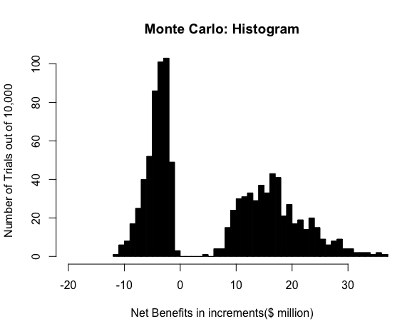

# Monte Carlo Analysis

### Background Information 
Hi, Welcome to my Github page - Monte Carlo Analysis
This is a Monte Carlo Analysis from Benefit Cost Analysis Course Assignment.

### Language Used 
- R-studio

### Computing Machine Used 
- local computer (MacBook Pro 2015)

---

## General Idea: 
* generate artificial data
* repeat random draws many times to elicit a distribution of outcomes
* It provides information about the variance of the statisticaldistribution of realized net benefits
* suppose two policies have the same expected net benefits, then we may recommend one with a smaller variance


### STEP 1: declare parameters maximum and minimum values
* specify probability distributions for all the important uncertain
quantitative assumptions
* if there is no evidence on a particular distribution, use uniform
distribution

### Desribtion of Parameters

*  County Population (N): Total Population in the county
*  Fraction High Risk (r): One half population over age 64
*  Low-Risk Vaccination (Vl): Fraction of low-risk persons vaccinated 
*  High-Risk Vaccination (Vh): Fraction of high-risk person vaccinated 
*  Adverse Reaction (alpha) : Fraction vaccinated who become high risk
*  Low-Risk Mortality (ml): Mortality rate for low-risk infected 
*  High-Risk Mortality (mh): Mortality rate for high-risk infected 
*  Herd Immunity Effect (theta): Fraction of eddectively vaccinated who contriure to herd immunity effect 
*  Vaccine Effectiveness (e): Fraction of vaccinated who develop immunity 
*  Hours Lost(t): Average Number of Work hours lost to illness
*  Infection Rate (i) :Infection rate without vaccine 
*  First-year Epidemic (P1): Change of epidemic in current year 
*  Second-year Epidemic (P2): Chance of epidemic next year 
*  Vaccine Dose Price (p): Price per dose of vaccine 
*  Overhead Cost (o): Costs not dependent on number vaccinated 
*  Opportunity Cost of Time (w): Average wage rate in the county
*  Value of Life(L): Assumed Value of Life
*  Discount Rate(d): Real Discount Rate
*  Number High-Risk Vaccinations (Vh): High Risk person vaccinated 
*  Number Low-Risk Vaccinations(Vl): Low Risk persons vaccinated 
*  Fraction Vaccinated (v): Fraction of total population vaccinated 


Load course-prepared values based on the 10 variables described above using *readxl* package 
```
library(readxl)
data=read_xls('EasyValues.xls')
head(data)
```

### STEP 2: generate random values for each parameter 

* execute a trial by taking a random draw from the distribution for each parameters to arrive at a set of specific values for computing realized net benefits
 
* At this step, take random values:
r in [0:04; 0:08]; vl in [0:03; 0:07]; vh in [0:4; 0:8]; alpha in [0:01; 0:05]
ml in [0:000025; 0:000075]; mh in [0:0005; 0:002]; theta in [0:5; 1]
e in [0:65; 0:85]; t in [18; 30]; i in [0:2; 0:3]
```
table<-vector()
z<-runif(1000,min=0, max=1)
r<- runif(1000,min=0.04, max=0.08)
vl<-runif(1000,min=0.03,max=0.07)
vh<-runif(1000,min=0.4,max=0.8)
a<-runif(1000,min=0.01,max=0.05)
ml<-runif(1000,min=0.000025,max=0.000075)
mh<- runif(1000,min=0.0005,max=0.002)
theta<-runif(1000,min=0.5,max=1)
e<-runif(1000,min=0.65,max=0.85)
t<-runif(1000,min=18,max=30)
i<-runif(1000,min=0.2,max=0.3)
```

### STEP 3: compute relevant variables

The mutually exclusive realizations of net benefits are:
* epidemic in neither year: NB = -(Ca + Cs )
* epidemic in current year: NB = -(Ca + Cs ) + (Cejnv - Cejv )
* epidemic in next year: NB = -(Ca + Cs ) + (Cejnv - Cejv )/(1 + d)

``` 
x<-data$Value
Vh<- x[1]*vh*r
Vl<-vl*(1-r)*x[1]
v<-(r*vh)+(vl*(1-r))
``` 

Compute Ca,Cs,Cenv,Cev
```
Ca<-(x[15]+(Vh+Vl)*x[14])/1000000 
Cs <- (a*(Vh+Vl)*((x[16]*t)+(mh*x[17])))/1000000
Cenv<- (i*{(r*x[1])*(x[16]*t+mh*x[17])+((1-r)*x[1]*(x[16]*t+ml*x[17]))})/1000000
Cev<- {(i-(theta*v*e))*((r*x[1]-e*Vh)*(x[16]*t +mh*x[17])+((1-r)*x[1]-e*Vl)*(x[16]*t +ml*x[17]))}/1000000
```

### STEP 4: compute for each combination of parameters - the 3 possible value of net benefits
```
NB_neither= -(Ca+Cs)
NB_p1= -(Ca+Cs)+(Cenv-Cev)
NB_p2= -(Ca+Cs)+((Cenv-Cev)/1+0.05)
```
Put all Value in one table 
```
table_bind<-cbind(r,vl,vh,a,ml,mh,theta,e,t,i, NB_neither,NB_p1,NB_p2)
```

### STEP 5: generate occurence of epidemy and find Net Benefits 

Generate random chances of occurance of epidemy
``` 
p1<- runif(10000,min=0, max=1)
p2<- runif(10000,min=0, max=1)
``` 
Simulate trials for 10,000 times
``` 
Actual_NB<-vector()
outcome<-vector()
for (j in 1:10000){
if (p1[j]<0.4) {
  Actual_NB <- c(Actual_NB, NB_p1[j])
  outcome<-c(outcome,'p1')
  }
  else if(p1[j]>0.4 & p2[j] <0.2) { 
    Actual_NB <- c(Actual_NB, NB_p2[j])
    outcome<-c(outcome,'P2')}
  else {
    Actual_NB <- c(Actual_NB, NB_neither[j])
    outcome<-c(outcome,'None')
  }
}

table<-data.frame(r,vl,vh,a,ml,mh,theta,e,t,p1,p2,outcome,NB_neither,NB_p1,NB_p2,Actual_NB)
summary(table)
``` 
### STEP 6: generate histogram
```
hist(Actual_NB, breaks=50 ,xlim=c(-20,35),ylim=c(0,100), main="Monte Carlo: Histogram", 
     ylab="# of Trials out of 1000",xlab="Net Benefits in increments($ million)")
```


# 


